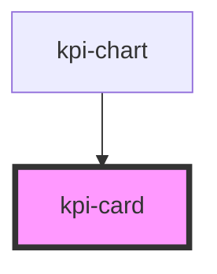

# kpi-card

<!-- Auto Generated Below -->

## Properties

| Property | Attribute | Description    | Type     | Default     |
| -------- | --------- | -------------- | -------- | ----------- |
| `icon`   | `icon`    | The icon       | `string` | `undefined` |
| `name`   | `name`    | The first name | `string` | `undefined` |
| `value`  | `value`   | The value      | `string` | `undefined` |

## Dependencies

### Used by

 - [kpi-chart](../kpi-chart)

### Graph

----------------------------------------------

*Built with [StencilJS](https://stenciljs.com/)*
