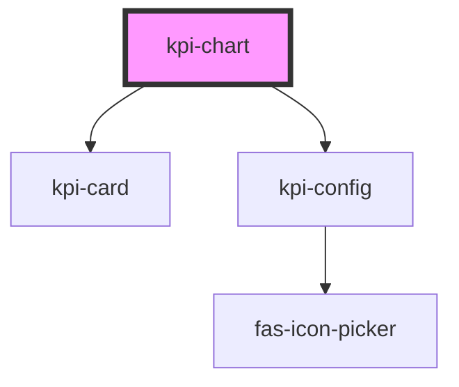

# kpi-chart

<!-- Auto Generated Below -->

## Properties

| Property | Attribute | Description | Type     | Default     |
| -------- | --------- | ----------- | -------- | ----------- |
| `data`   | `data`    | TODO :      | `string` | `undefined` |

## Events

| Event         | Description | Type                                                           |
| ------------- | ----------- | -------------------------------------------------------------- |
| `configSaved` |             | `CustomEvent<{ mapping: { name: string; icon: string; }[]; }>` |

## Dependencies

### Depends on

- [kpi-card](../kpi-card)
- [kpi-config](../kpi-config)

### Graph

----------------------------------------------

*Built with [StencilJS](https://stenciljs.com/)*
