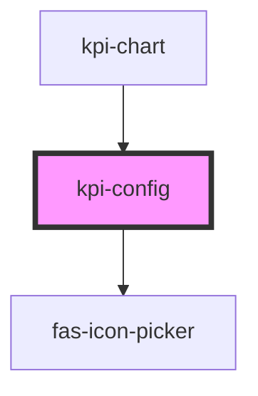

# kpi-config

<!-- Auto Generated Below -->

## Properties

| Property      | Attribute     | Description | Type                                               | Default     |
| ------------- | ------------- | ----------- | -------------------------------------------------- | ----------- |
| `cards`       | --            |             | `{ name: string; value: string; icon: string; }[]` | `undefined` |
| `open`        | `open`        |             | `boolean`                                          | `false`     |
| `transparent` | `transparent` |             | `boolean`                                          | `false`     |

## Events

| Event         | Description | Type                                                           |
| ------------- | ----------- | -------------------------------------------------------------- |
| `configSaved` |             | `CustomEvent<{ mapping: { name: string; icon: string; }[]; }>` |

## Dependencies

### Used by

 - [kpi-chart](../kpi-chart)

### Depends on

- [fas-icon-picker](../fas-icon-picker)

### Graph

----------------------------------------------

*Built with [StencilJS](https://stenciljs.com/)*
